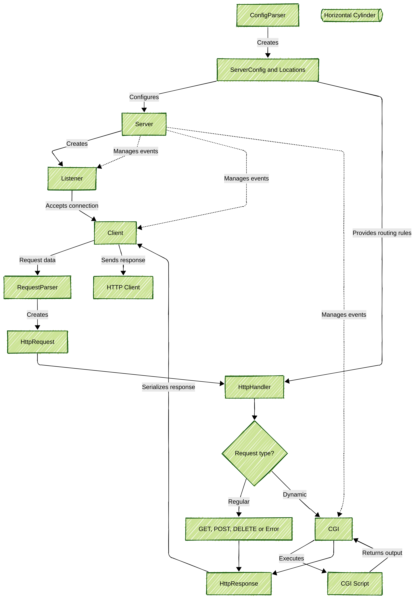
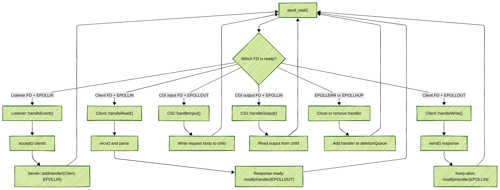
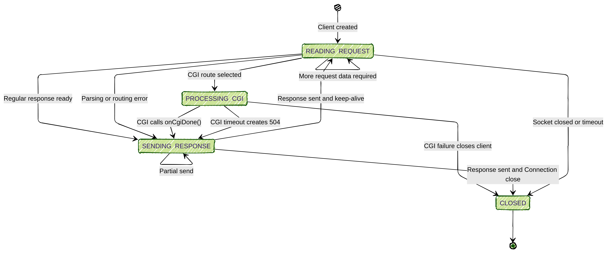
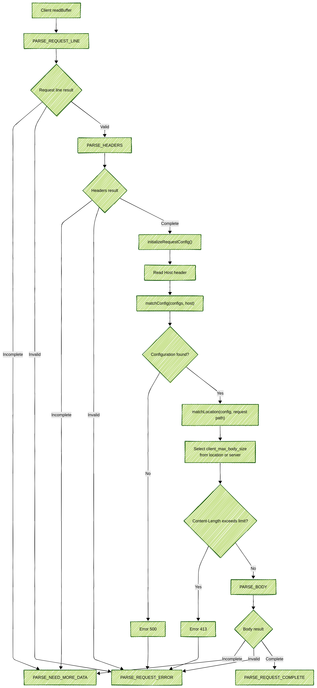
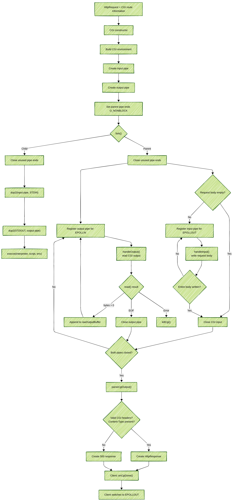

# WEBSERV DEVELOPMENT OVERVIEW

## GENERAL ARCHITECTURE

Webserv is an HTTP server written in C++98. It reads the configuration, accepts client connections, parses HTTP requests, processes the requested resource, and sends HTTP responses.
The main project parts are:

- **Server:** Manages connections and events.
- **Configuration Parser:** Defines how the server behaves.
- **HTTP:** Parses and processes requests.
- **CGI:** Executes scripts and generates dynamic responses.

## MAIN CLASSES
The project is divided into classes with separate responsibilities.

The main classes communicate during configuration loading, connection management, request processing, CGI execution, and response generation.

## SERVER AND EVENT LOOP
The server manages network connections and coordinates the other parts of the project.

Its main responsibilities are:

- Creating listening sockets
- Accepting new clients
- Managing non-blocking file descriptors
- Monitoring sockets and CGI pipes
- Sending events to the correct handler
- Managing client and CGI timeouts

The server uses `epoll()` to manage multiple clients without waiting for one client to finish.

## CLIENT STATES
A `Client` object represents one connected client.

During its lifecycle, the client moves between these main states:

- **Reading Request:** Receiving and parsing HTTP data
- **Processing CGI:** Waiting for a CGI program
- **Sending Response:** Sending the result to the client

After sending the response, the connection is either closed or kept open for another request.

## CONFIGURATION PARSER
The configuration parser reads the configuration file and creates the rules used by Webserv.
It manages information such as:

1. Hosts and ports
2. Server names
3. Root directories
4. Locations
5. Allowed HTTP methods
6. Index files
7. Redirections
8. Error pages
9. CGI mappings
10. Upload settings
11. Request body-size limits

The parsed configuration is used during server initialization, HTTP parsing, and routing.

## HTTP REQUEST PARSING
The request parser converts the raw data received from a client into an `HttpRequest`.

It parses:

1. The request line
2. The request headers
3. The optional request body

It also selects the correct server configuration using the `Host` header and checks the maximum request body size.

The parser can return:
1. The request is complete
2. More data is required
3. The request contains an error

## ROUTING AND REQUEST HANDLING
After parsing, `HttpHandler` decides how the request should be processed.

It performs the following operations:

1. Matches the request path with a location
2. Checks configured redirects
3. Checks whether the method is allowed
4. Resolves directories and index files
5. Checks whether the request is CGI
6. Processes `GET`, `POST`, and `DELETE`
7. Creates an error response when necessary

## CGI
CGI allows Webserv to execute scripts and return dynamic content.

For a CGI request, Webserv:

1. Creates input and output pipes
2. Creates a child process using `fork()`
3. Runs the interpreter and script using `execve()`
4. Sends the request body through the input pipe
5. Reads the script output through the output pipe
6. Converts the CGI output into an HTTP response

The CGI pipes are non-blocking and are monitored by the same `epoll()` event loop as the network sockets.

## COMPLETE REQUEST FLOW
The complete request lifecycle is:

1. The configuration file is parsed.
2. The server creates its listeners.
3. The server starts the `epoll()` event loop.
4. A client connects to the server.
5. The client sends an HTTP request.
6. The request parser creates an `HttpRequest`.
7. The HTTP handler resolves the route.
8. The request is processed as a regular HTTP request or CGI request.
9. Webserv creates an `HttpResponse`.
10. The response is sent to the client.
11. The connection is closed or reused.
