This server uses an EVENT-DRIVEN, NON-BLOCKING I/O model powered by Linux's EPOLL API.
Instead of spawning a new THREAD for every CLIENT (which consumes heavy resources), the server runs on a SINGLE THREAD. It uses EPOLL to monitor multiple SOCKETS simultaneously and only wakes up to process SOCKETS that are actively ready to read or write.

## **1- CORE ENTITIES (CLASS DIAGRAM)**

- Server (The Orchestrator): Manages the EPOLL instance. It holds MAPS of active LISTENERS and CLIENTS to route EPOLL EVENTS to the correct objects.
- Listener (The Port Manager): Binds to a specific PORT. It handles accepting new CONNECTIONS and executing READ/WRITE operations for the CLIENTS connected to that PORT.
- Client (The Connection State): A wrapper around an active CLIENT SOCKET (FD). It holds the BUFFERS for incoming and outgoing data, ensuring partial READS/WRITES do not block the server.

## **2- THE EVENT LOOP & STATE MACHINE**

The lifeblood of the server is the EVENT LOOP. It reacts to EVENTS rather than proactively checking SOCKETS.

**2.1 EPOLL STATES EXPLAINED**

- EPOLLIN: Wakes up the server because there is data to READ (or a new CLIENT to ACCEPT).
- EPOLLOUT: Wakes up the server because the SOCKET'S internal OS BUFFER is ready to accept outgoing data.
- EPOLLERR / EPOLLHUP: Wakes up the server because the CONNECTION dropped or errored.

**2.2 EXECUTION WORKFLOW**

## **3- BUFFER MANAGEMENT**

Because SOCKETS are configured as NON-BLOCKING, a single read or write call might not process the entire HTTP REQUEST or RESPONSE.

How we handle this:

1. READ BUFFER: Data is continuously appended to the CLIENT'S memory. We do not process the REQUEST until we detect the end of the HTTP HEADERS.
2. WRITE BUFFER: When an HTTP RESPONSE is generated, it is pushed into the CLIENT'S memory. We send as much as the OS allows, and erase only the bytes that were successfully sent. We keep trying on subsequent EPOLLOUT events until the BUFFER is empty.