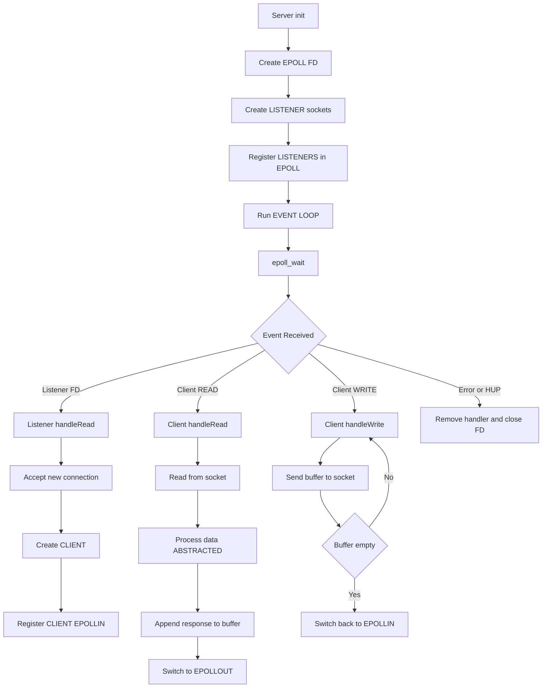

# **SYSTEM INTRODUCTION**

This project implements an  **EVENT-DRIVEN** , **NON-BLOCKING TCP SERVER** built on **EPOLL** and structured around the  **REACTOR PATTERN** .

The architecture is designed to handle multiple simultaneous connections efficiently using a  **SINGLE EVENT LOOP** , avoiding blocking operations and thread-per-connection models.

### **EXECUTION FLOW OVERVIEW**

* The `Server` initializes:
  * Creates an **EPOLL INSTANCE**
  * Registers **LISTENER SOCKETS** (one per port)
* The **EVENT LOOP** (`runEventLoop`) continuously:
  * Waits for I/O events using `epoll_wait`
  * Dispatches events to objects implementing **IEVENTHANDLER**
* Runtime components:
  * `Listener` → accepts new connections
  * `Client` → manages active connections
* Each **FILE DESCRIPTOR (FD)** is mapped to a handler object, enabling **POLYMORPHIC EVENT DISPATCH**

> NOTE: **HTTP PARSING** and **RESPONSE GENERATION** are part of the flow but intentionally abstracted into dedicated components.

# **CLASS ARCHITECTURE**

| Class Name              | Core Responsibility                                    | Key Functions & Purpose                                                                                                                                                                                                                             |
| ----------------------- | ------------------------------------------------------ | --------------------------------------------------------------------------------------------------------------------------------------------------------------------------------------------------------------------------------------------------- |
| **Server**        | Central**EVENT DISPATCHER**and lifecycle manager | `runEventLoop()`→ Core**EVENT LOOP**using EPOLL `init()`→ Initialize listeners and group configs `addHandler()`→ Register FD into EPOLL `modifyHandler()`→ Update READ/WRITE interest `removeHandler()`→ Cleanup and remove FD |
| **Listener**      | Accept incoming TCP connections                        | `loadListener()`→ Create/bind/listen socket `handleRead()`→ Accept new clients and register them                                                                                                                                              |
| **Client**        | Represent and manage a single connection               | `handleRead()`→ Read incoming data and trigger processing (abstracted)`handleWrite()`→ Send outgoing data `matchConfig()`→ Select configuration ( **VIRTUAL HOSTING** )                                                              |
| **IEventHandler** | Interface for all event-driven components              | `handleRead()`/`handleWrite()`→ Unified**EVENT HANDLING CONTRACT**                                                                                                                                                                       |

# **REACTOR PATTERN (CORE)**

## **WHAT IS THE REACTOR PATTERN**

The **REACTOR PATTERN** is an architectural pattern used to handle multiple I/O operations using a  **SINGLE EVENT LOOP** .

Instead of:

* blocking on each connection
* or creating multiple threads

the system:

1. Waits for events using **EPOLL**
2. Identifies the associated handler
3. Dispatches the event to the correct object
4. Reacts accordingly ( **READ / WRITE** )

## **WHERE IT EXISTS IN THE CODE**

The core of the pattern is implemented in:

```cpp
Server::runEventLoop()
```

This function:

* Calls `epoll_wait`
* Retrieves active **FILE DESCRIPTORS**
* Dispatches events to their corresponding **HANDLERS**

## **WHY WE USE THE REACTOR PATTERN**

### **SCALABILITY**

* Supports thousands of concurrent connections
* Eliminates **THREAD PER CONNECTION** overhead

### **PERFORMANCE**

* Uses **NON-BLOCKING I/O**
* CPU is only used when events occur

### **SEPARATION OF CONCERNS**

* `Server` → EVENT DISPATCHING
* `Listener` → CONNECTION ACCEPTANCE
* `Client` → CONNECTION MANAGEMENT

### **FLEXIBILITY**

* New components can be added by implementing **IEVENTHANDLER**
* No need to modify the core event loop

## **FLEXIBILITY EXAMPLE: ADDING CGI SUPPORT**

The design allows extending the server without modifying the core architecture.

### **STEP 1: CREATE A NEW HANDLER**

```cpp
class CGIHandler : public IEventHandler
{
    int pipeFD;

public:
    void handleRead();
    void handleWrite();
    int getFD() const;
};
```

### **STEP 2: INTEGRATE WITH THE SERVER**

* When a request requires  **CGI EXECUTION** :
  * A `CGIHandler` is created
  * It is registered in EPOLL:

```cpp
server->addHandler(cgiHandler, EPOLLIN);
```

### **STEP 3: LET THE REACTOR HANDLE IT**

* EPOLL monitors the **PIPE FD**
* Events are dispatched like any other socket
* No blocking operations are introduced
* No changes to `Server` or `Client` are required

# **CUTION FLOW**


